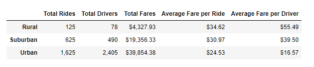
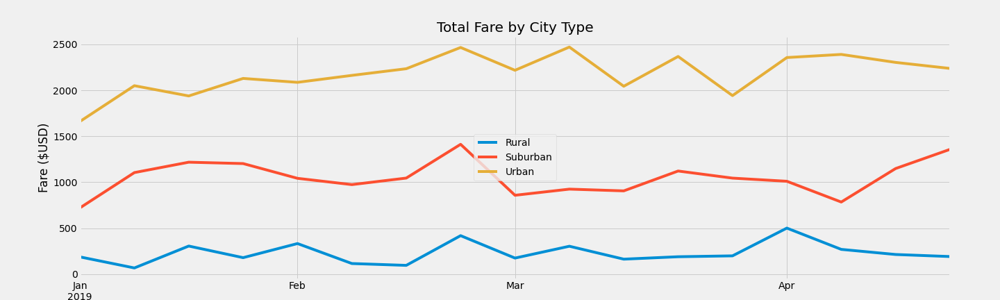

# PyBer Analysis

## Overview
The purpose of this analysis is to provide a summary of ride-sharing data by city type. With this data, we can show how the number rides is affected by city type and fare amount to help PyBer make better informed decisions. 

### Resources
- Data source: city_data.csv, ride_data.csv
- Software: Python 3.7.6, Jupyter Notebook

## Results
- Based on my analysis, PyBer has the least amount of business in rural cities. They have fewer drivers and higher fares, which may have a correlation with the low number of rides compared with suburban and urban cities. Urban cities, unsurprisingly, have the highest number of rides. While part of these numbers are impacted by the population of the cities, it can be inferred that a high fare for riders discourages them from riding.
  
- There seemed to be a uptick in fare prices or number of rides in February, so further analysis should be made to see the reason behind this peak. An interesting part of this peak is it occurred in all three city types around the same time. 

## Summary
PyBer should consider a few things moving forward. First, it seems like a high fare rate in rural cities discourages riders from using PyBer. PyBer should look at potentially lowering the fare rate to increase the number of riders and drivers in rural cities to engage more customers. Additionally, PyBer should do further analysis into the statistics from late February 2019 to understand why there was a peak in all three types of cities. Based on that analysis, it may be understood what made PyBer popular then and possible methods of increasing customers. Finally, PyBer should consider looking at the number of drivers in rural cities and try to increase that number. There is a low number of drivers which limits the number of rides that can be made.
